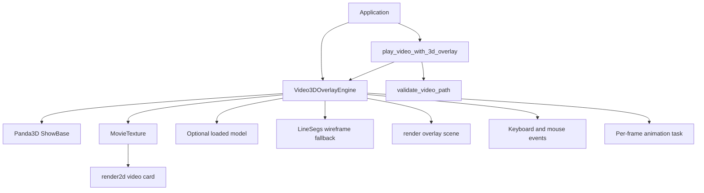

# Architecture and Design Description

## 1. Architecture Summary

The library has a deliberately narrow runtime architecture:



The application owns the process and chooses whether to use the convenience
function or the engine class directly. Panda3D owns the render loop, scene
roots, asset loader, input messenger, and task manager.

## 2. Component Responsibilities

### `__init__.py`

Provides the version and top-level names. Graphics-backed names are loaded
lazily so dependency-light validation utilities can be imported by tooling
without importing a backend or constructing a graphics window.

### `utils.py`

Provides filesystem and extension validation without Panda3D. It defines the
canonical accepted extension set and is the earliest failure boundary.

### `engine.py`

Owns runtime orchestration:

- `ShowBase` initialization and default mouse-camera disabling.
- Movie texture, audio, and background-card setup.
- Model loading and fallback geometry creation.
- Input event registration.
- Animation and drag state.
- Convenience entry point that starts `ShowBase.run()`.

### `pygame_backend.py`

Uses Pygame for window and event management, PyOpenGL for rendering, and
OpenCV for video frames. It is a lower-level alternative to the Panda3D scene
graph and draws a wireframe sphere as its interactive shape.

### `opencv_backend.py`

Uses OpenCV for video acquisition and classical motion detection, then
ModernGL for GPU texture upload and presentation. `moderngl-window` supplies
the native window integration required by ModernGL.

## 3. Scene Graph Design

The background and overlay use separate Panda3D scene roots:

```text
render2d
└── video-background card
    └── MovieTexture

render
└── overlay
    ├── loaded model, or
    └── generated LineSegs wireframe
```

The card is normalized to the render2d frame and assigned to the `background`
bin with depth operations disabled. The overlay remains a normal 3D node and
therefore participates in the 3D render path.

## 4. Lifecycle

### Construction

The constructor validates the video path, initializes Panda3D, configures the
background, selects the model or fallback, binds controls, and registers one
animation task.

### Runtime

Panda3D calls `_animate_overlay` once per frame. It applies mouse deltas while
the primary button is held. Otherwise, it applies automatic heading rotation
based on task time. Keyboard events directly update the overlay position.

### Shutdown

The application exits through Panda3D's normal window/application lifecycle.
The current API does not provide a separate public `close()` or playback
lifecycle object.

## 5. Design Decisions

### Runtime composition instead of video export

Keeping the movie as a texture preserves the source asset and allows the 3D
scene to remain interactive. Export is deliberately outside the product scope.

### Fallback geometry

A generated wireframe makes model setup failures visible and keeps the engine
usable for demos. It also avoids requiring an additional bundled asset.

### Early validation

Validation before `ShowBase` construction prevents predictable user input
errors from opening a graphics window and makes command-line failures easier
to diagnose.

### Lazy public engine import

The package initializer exposes the documented engine names while deferring
the Panda3D import until those names are requested. This preserves a useful
headless path for `video3doverlay.utils` and packaging tools.

## 6. Operational Boundaries

The engine does not own:

- Video transcoding or media conversion.
- Computer vision, calibration, or tracking.
- Asset downloading.
- Application-specific UI or persistence.
- A multi-window or embedded-renderer policy.

The three backends are alternatives. A host application should select one
entry point for a process rather than combining their native window loops.

Those concerns should be implemented by a host application or a future
higher-level package layer.

## 7. Extension Points

Potential future extension points, in increasing scope:

1. Public playback controls around the existing `MovieTexture`.
2. Configuration objects for initial transforms, card fit, and input bindings.
3. A renderer abstraction for embedded/off-screen use.
4. A calibration module mapping video coordinates to Panda3D camera space.
5. Integration tests using known media fixtures and a controlled graphics
   backend.

New abstractions should be introduced only when the corresponding behavior is
needed by a stable public use case.

## 8. Failure Boundaries

| Boundary | Behavior |
| --- | --- |
| Invalid path | Raise validation exception before window creation |
| Movie load/configuration | Log and raise `RuntimeError` |
| Model load | Log and use wireframe fallback |
| Missing audio stream | Continue video playback without audio synchronization |
| Missing mouse input | Continue automatic rotation |

## 9. Architectural Risks

The normalized card currently prioritizes predictable full-frame coverage over
aspect-ratio preservation. Model placement is a simple world-space default,
not a calibrated projection. These are documented limitations and should be
addressed through explicit configuration rather than hidden heuristics.
